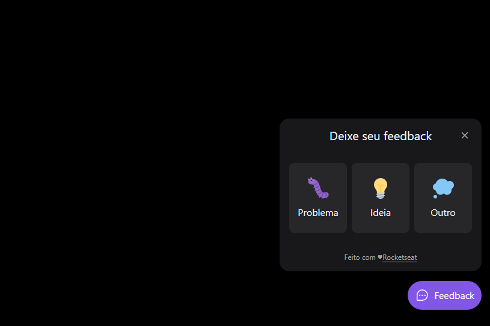
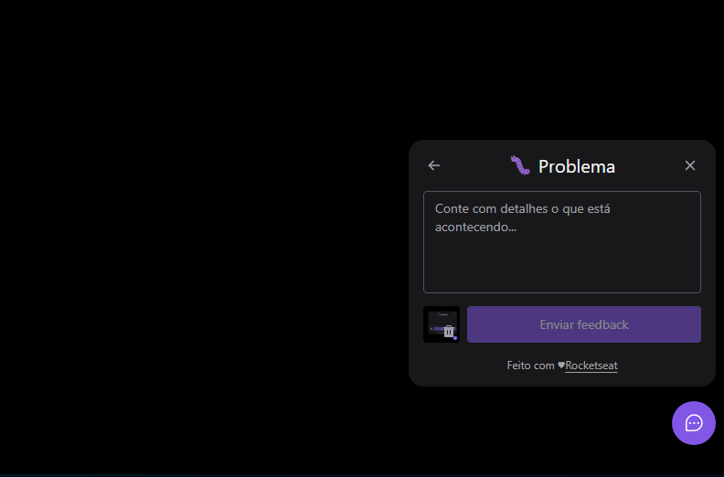
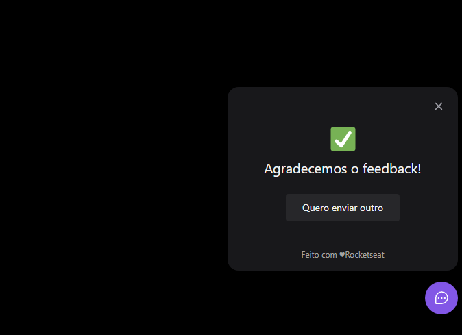

# Feedback Widget
Awesome app Widget created during the NLW Return! 

## Details
This widget allow the user to report a Bug, Idea or other intention with some text and being able to attach a screenshot.
The website is responsible and compatible with mobile and PC. The mobile part also is able to be deployed to iOS and Android.

 ### Features:
 - All the backend is provided by NodeJS and the database is made at PostgreSQL.
 - The frontend is made with ReactJS and works fine cross-platform.
 - This project also has a mobile project inside of it made with React Native that works fine with iOS and Android.
 
## How to run the app
Download the repo, and use one of the following commands to run as develop instance:
 - For Server and Web: npm run dev
 - For Mobile: expo start (You will need Expo app on your mobile to access the develop instance.)

## Authors

* **André Zottis** - *Initial work* - [AndreZottis](https://github.com/andrezottis)

## License

This project is licensed under the MIT License - see the [LICENSE.md](LICENSE.md) file for details

## Special Thanks
I just want to thank you [Rocketseat](https://rocketseat.com.br) for this awesome opportunity to learn NodeJS and React. This week was really amazing and I've learned a lot!

## Some App Images

